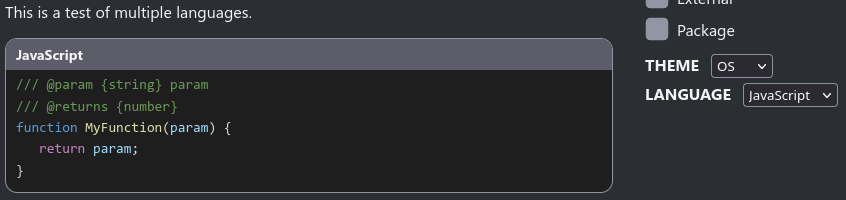

# typedoc-plugin-language-switcher
Implements a language switcher feature into TypeDoc pages, allowing your documentation to be switched between different language modes. Multi-language code blocks will only show the code for the language the user specifies, which can be toggled at any time.

## Configuration
Install the package, and add it to your `typedoc.json`:
```json
{
    "plugin": [
        "typedoc-plugin-language-switcher"
    ],
    "languages": []
}
```

A new configuration option called `languages` is added, which is an array of strings specifying the language modes for your site. This must contain the exact language IDs you use for code blocks, in the order that they will be listed in the docs. For example, for a site with TypeScript and JavaScript modes, set this to `["ts", "js"]`, and use \`\`\`ts and \`\`\`js code blocks. Note that this will not match aliases as well, so the aforementioned setting would **not** match \`\`\`typescript blocks. The first language in the list will be the default selection.

## Usage
To make a multi-language code block, simply write \`\`\` code blocks for each language, in the order listed in `languages`. No further configuration is required! For example:

```js
/**
 * This is a test of multiple languages.
 * 
 * ```ts
 * function MyFunction(param: string): number {
 *    return param as number;
 * }
 * ```
 * ```js
 * /// @param {string} param
 * /// @returns {number}
 * function MyFunction(param) {
 *    return param;
 * }
 * ```
 */
```

  


Any text between each code block will suppress making it multi-language, such as `&nbsp;`. Blocks that are not in this format, or are in other languages, will display as normal. Be aware that the styling system currently only chains pairs of blocks, so if you have more than two languages, consecutive blocks of any two registered languages in order will also be treated as multi-language despite not having all of the registered languages.

The selected language can be changed in the settings dropdown in the sidebar. This setting will be saved in local storage, so it persists across pages. (*Note: Local storage use here is not controlled by the `TypeDoc.disableLocalStorage` API! This is due to it being impossible to fetch the underlying state from the API.*) To improve readability, the name of the language for every highlighted code block is added in a header above the code block.